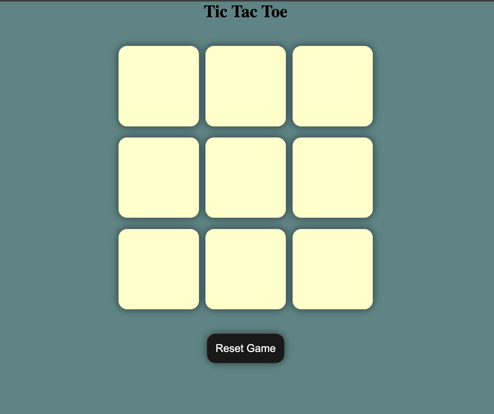
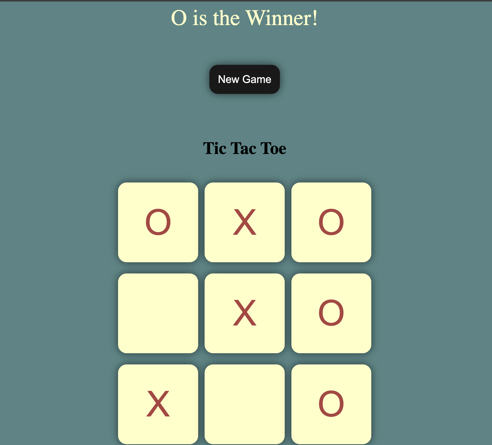
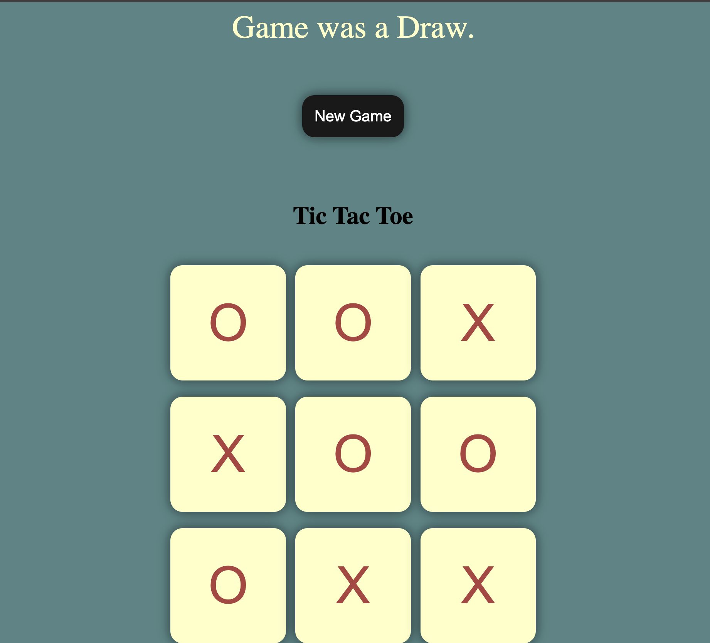

# 🎮 Tic Tac Toe Game

A simple and interactive **Tic Tac Toe** game built using **HTML, CSS, and JavaScript**.  
This project is beginner-friendly and focuses on DOM manipulation and event handling in JavaScript.

---

## 📸 Screenshot
<div display="inline-block">
  
  
  
</div>

---

## 🚀 Features

- Two-player game (X vs O)
- Interactive 3×3 grid
- Win and draw detection
- Reset game functionality
- Clean and responsive UI
- Built using **vanilla JavaScript**

---

## 🧠 Concepts Used

- HTML structure and semantics
- CSS styling and layout
- JavaScript DOM manipulation
- Event listeners (`click`)
- Game logic implementation

---

## 📁 Project Structure

```text
TicTacToe/
├── index.html      # HTML structure of the game
├── style.css       # Styling and layout
├── app.js          # Game logic and event handling
├── assets/
│   └── tictactoe.png
└── README.md
```

---

## ▶️ How to Run the Project

1. Clone the repository:
   ```bash
   git clone https://github.com/Akshitha010/Tic-Tac-Toe
   ```

2. Open `index.html` in any web browser.

✅ No installation or server setup required.

---

## 🎯 How the Game Works

- The game board consists of a 3×3 grid.
- Players take turns clicking on empty cells.
- Each click places an **X** or **O** on the board.
- After every move, the game checks for:
  - A winning combination
  - A draw condition
- A reset option allows players to restart the game.

---

## 🔮 Future Improvements

- Single-player mode (play against computer)
- Scoreboard for tracking wins
- Animations and sound effects
- Improved mobile responsiveness

---

## 📜 License

This project is open-source and free to use for learning and practice.

---

### ✨ Author

Built as part of JavaScript learning and practice.
